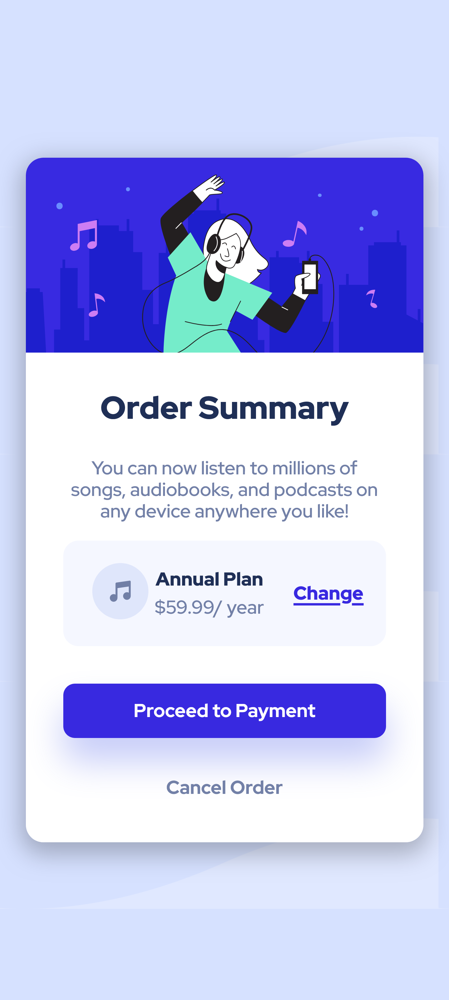

# Frontend Mentor - Order summary card solution

This is a solution to the [Order summary card challenge on Frontend Mentor](https://www.frontendmentor.io/challenges/order-summary-component-QlPmajDUj). Frontend Mentor challenges help you improve your coding skills by building realistic projects. 

## Table of contents

- [Overview](#overview)
  - [The challenge](#the-challenge)
  - [Screenshot](#screenshot)
  - [Links](#links)
- [My process](#my-process)
  - [Built with](#built-with)
  - [What I learned](#what-i-learned)
  - [Continued development](#continued-development)
  - [Useful resources](#useful-resources)
- [Author](#author)
**Note: Delete this note and update the table of contents based on what sections you keep.**

## Overview

### The challenge

Users should be able to:

- focus all content

### Screenshot




### Links

- Solution URL: [Repository](https://github.com/YandroRB/order-summary)
- Live Site URL: [Live Site](https://yandrorb.github.io/order-summary/)

## My process

### Built with

- Semantic HTML5 markup
- CSS custom properties
- Flexbox
- CSS Grid

### What I learned
I learned how to center an object with Grid:
```css
body{
    min-height: 100vh;
    display: grid;
    place-items: center;
    background: url('../images/pattern-background-desktop.svg'),var(--primary-pale-blue);
    background-repeat: no-repeat;
    background-size: contain;
    font-family: var(--ff-main);
}
```
I try to use CSS variables:
```css
:root{
    --primary-pale-blue:hsl(225, 100%, 94%);
    --primary-bright-blue:hsl(245, 75%, 52%);
    --very-pale-blue: hsl(225, 100%, 98%);
    --desaturated-blue: hsl(224, 23%, 55%);
    --dark-blue: hsl(223, 47%, 23%);
    --opacity-primary-bright-blue:hsla(245, 75%, 52%, 0.65);
    --ff-main:'Red Hat Display', sans-serif;
}
```


### Continued development

In my future projects I would like to create a page that is reactive to what the user does, with animated objects.

### Useful resources

- [A Complete Guide to CSS Grid](https://css-tricks.com/snippets/css/complete-guide-grid/) - This helped me to review the use of grid in CSS so it helped me focus all the content

## Author

- Frontend Mentor - [@yandrorb](https://www.frontendmentor.io/profile/YandroRB)
